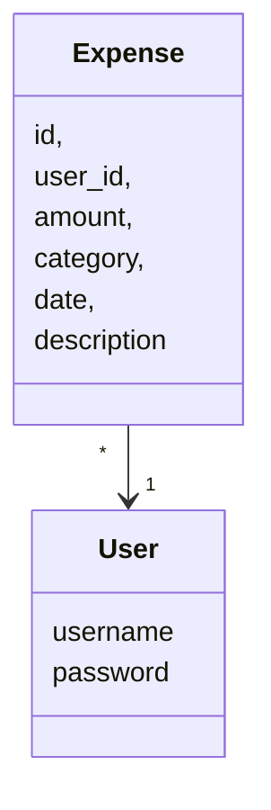
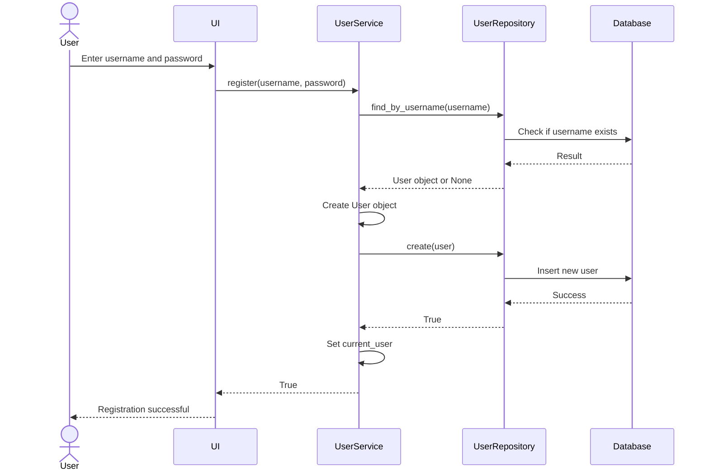

# Arkkitehtuurikuvaus
## Rakenne
koodin pakkausrakenne on seuraava:
  
Pakkaus ui sisältää koodin, joka vastaa käyttöliittymästä. Pakkaus services sisältää sovelluslogiikasta vastaavan koodin. Pakkaus repositories sisältää koodin, joka vastaa tietojen pysyväistallennuksesta. Pakkaus entities sisältää luokkia, jotka kuvaavat sovelluksen käsittelemiä tietokohteita.

## Käyttöliittymä

Sovelluksen käyttöliittymä koostuu neljästä eri näkymästä:

- Kirjaudu sisään
- Luo uusi käyttäjä
- Päänäkymä, jossa luetellaan käyttäjän kulut.
- Luo työnkulku (muokkaa samalla sivulla)

Kaikki näkymät toteutetaan omassa luokassaan. Menojen muokkaus- ja poistoikkunat on toteutettu metodeina päänäkymässä.

## Sovelluslogiikka

Sovelluksen loogisen tietomallin muodostavat luokat [User](/src/entities/user.py) ja [Expense](/src/entities/expenses.py), jotka kuvaavat käyttäjiä ja käyttäjien kuluja:


Toiminnallisista kokonaisuuksista vastaa luokkaan UserService ja ExpenseService ainoa olio. Luokat tarjoavat kaikille käyttöliittymän toiminnoille oman metodin. Näitä ovat esimerkiksi:

- login(username, password)
- add_expense(user_id, amount, category, description, date)
- get_user_expenses(user_id)
- get_monthly_report(user_id, year, month)
- delete_expense(user_id, expense_id)

UserService ja ExpenseService pääsee käsiksi käyttäjiin ja kuluihin tietojen tallennuksesta vastaavan pakkauksen repositories sijaitsevien luokkien UserRepository ja ExpenseRepository kautta. Luokkien toteutuksen injektoidaan sovelluslogiikalle konstruktoritkutsujen yhteydessä.

## Tietojen pysyväistallennus
Repositories luokat [ExpenseRepository](/src/repositories/expense_repository.py) ja [UserRepository](/src/repositories/user_repository.py) huolehtivat tietojen tallettamisesta. Molemmat luokat tallentavat tietoa SQLite-tietokantaan.
### Tietokanta
Sovellus tallentaa käyttäjien ja kulujen tiedot SQLite-tietokantaan. Tietokanta koostuu kahdesta taulusta:
- users: Sisältää käyttäjien tiedot
- expenses: Sisältää käyttäjien kulut

Tietokanta alustetaan [nitialize_database.py](/src/initialize_database.py), jossa määritellään taulujen rakenne:
- Users-taulu
```sql
CREATE TABLE users (
    id INTEGER PRIMARY KEY AUTOINCREMENT,
    username TEXT UNIQUE NOT NULL,
    password TEXT NOT NULL
)
```
- Expenses-taulu
```sql
CREATE TABLE expenses (
    id INTEGER PRIMARY KEY AUTOINCREMENT,
    user_id INTEGER NOT NULL,
    amount REAL NOT NULL,
    category TEXT NOT NULL,
    date TEXT NOT NULL,
    description TEXT,
    FOREIGN KEY (user_id) REFERENCES users (id)
)
```

## Sovelluksen päätoiminnallisuudet
Kuvaataan muutama sovelluksen päätoiminnallisuuden sekvenssikaaviona.

### Käyttäjän luominen
Kun rekisteröintinäkymään syötetään käyttäjätunnus ja salasana, joita ei ole vielä käytetty, ja "Submit"-paniketta napsautetaan, sovelluksen hallinta etenee seuraavasti:


### Käyttäjän kirjautuminen
Kun syödään käyttäjätunnuksia ja salasanaa kirjautumisnäytön syöttökenttiin ja napsautat "Login"-painiketta, sovelluksen hallinta toimii seuraavasti:
```mermaid
sequenceDiagram
  actor User
  participant UI
  participant UserService
  participant UserRepository
  participant Database
  
  User->>UI: Enter username and password
  UI->>UserService: login(username, password)
  UserService->>UserRepository: find_by_username(username)
  UserRepository->>Database: Query user data
  Database-->>UserRepository: User data
  UserRepository->>UserRepository: User.from_database_row(row)
  UserRepository-->>UserService: User object
  UserService->>UserService: Verify password match
  UserService->>UserService: Set current_user
  UserService-->>UI: True
  UI-->>User: Login successful
  ```

### Uuden kulun luominen
Uuden kulun luovan "Save" painikkeen klikkaamisen seurauksena tapahtuva sovelluksen toimintalogiikka sekvenssikaaviona:
```mermaid
sequenceDiagram
  actor User
  participant UI
  participant ExpenseService
  participant Expense
  participant ExpenseRepository
  participant Database
  
  User->>UI: Enter expense details
  UI->>ExpenseService: add_expense(user_id, amount, category, description, date)
  ExpenseService->>ExpenseService: Set date if not provided
  ExpenseService->>Expense: Expense(user_id, amount, category, description, date)
  ExpenseService->>ExpenseRepository: create(expense)
  ExpenseRepository->>Database: Insert expense data
  Database-->>ExpenseRepository: Success
  ExpenseRepository-->>ExpenseService: True
  ExpenseService-->>UI: True
  UI-->>User: Expense successfully added
```
### Muut toiminnallisuudet
Kaikki toiminnot noudattavat yhtenäistä loogista kulkua. Käyttäjä käynnistää toiminnon käyttöliittymän (UI) kautta, joka välittää pyynnön vastaavalle Service-kerrokselle (UserService tai ExpenseService). Service-kerros vastaa Entites-objektin (User tai Expense) luomisesta tai käsittelystä ja kutsuu sitten vastaavaa Repository-kerrosta (UserRepository tai ExpenseRepository) tietokantaoperaatioiden suorittamiseksi. Repository-kerros on vuorovaikutuksessa tietokannan kanssa BaseRepository-tietovaraston tarjoamien julkisten menetelmien kautta operaatioiden suorittamiseksi. Operaation tulos palautetaan sitten käyttäjälle samaa polkua pitkin, jolloin koko toiminnallinen prosessi saadaan päätökseen.
