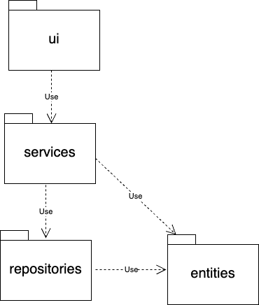

# Arkkitehtuurikuvaus
HUOM! Lisään Repository Pattern-tyyppisen rakenteen myöhemmin, tämä johtaa valtaviin rakenteellisiin muutoksiin. Joten en kirjoita paljon sisältöä arkkitehtuurille juuri nyt. 

## Rakenne
koodin pakkausrakenne on seuraava:

Pakkaus _ui_ sisältää kaikki käyttöliittymänäkymät, käsittelee käyttäjän vuorovaikutusta ja tietojen näyttöä. _Entitles_ sisältää sovelluksen tietomallin.

## Käyttöliittymä

Sovelluksen käyttöliittymä koostuu neljästä eri näkymästä:

- Kirjaudu sisään
- Luo uusi käyttäjä
- Päänäkymä, jossa luetellaan käyttäjän kulut.
- Luo työnkulku (muokkaa samalla sivulla)

Kaikki näkymät toteutetaan omassa luokassaan. Menojen muokkaus- ja poistoikkunat on toteutettu metodeina päänäkymässä.

## Sovelluslogiikka

Sovelluksen loogisen tietomallin muodostavat luokat [User](/src/entities/user.py) ja [Expense](/src/entities/expenses.py), jotka kuvaavat käyttäjiä ja käyttäjien kuluja:


## Sovelluksen päätoiminnallisuudet

### Käyttäjän luominen


### Käyttäjän kirjautuminen

```mermaid
sequenceDiagram
    actor User
    participant LoginView
    participant User_Class
    participant Database
    participant ExpensesView
    
    User->>LoginView: Enter username and password
    User->>LoginView: Click "Login" button
    LoginView->>LoginView: handle_login()
    LoginView->>User_Class: create User(username)
    LoginView->>User_Class: user_obj.find_by_username()
    User_Class->>Database: get_db_connection()
    User_Class->>Database: SELECT FROM users
    Database-->>User_Class: user_data
    User_Class-->>LoginView: user_data
    LoginView->>LoginView: Check password
  ```

### Uuden kulun luominen

Uuden kulun luovan "Add Expense" painikkeen klikkaamisen seurauksena tapahtuva sovelluksen toimintalogiikka sekvenssikaaviona:

```mermaid
sequenceDiagram
    actor User
    participant ExpensesView
    participant AddExpenseView
    participant Expense_Class
    participant Database
    
    User->>ExpensesView: Click "Add New Expense"
    ExpensesView->>ExpensesView: open_add_expense()
    ExpensesView->>AddExpenseView: Create AddExpenseView
    AddExpenseView-->>User: Show add expense form
    User->>AddExpenseView: Enter expense details
    User->>AddExpenseView: Click "Save" button
    AddExpenseView->>AddExpenseView: save_expense()
    AddExpenseView->>AddExpenseView: Validate inputs
    AddExpenseView->>Expense_Class: Create Expense with user_id and details
    AddExpenseView->>Expense_Class: expense.create()
    Expense_Class->>Database: get_db_connection()
    Expense_Class->>Database: INSERT INTO expenses
    Database-->>Expense_Class: Result (success/failure)
    Expense_Class-->>AddExpenseView: True/False
    AddExpenseView-->>User: Show success/error message
    AddExpenseView->>AddExpenseView: destroy()
    ExpensesView->>ExpensesView: load_expenses()
    ExpensesView->>Expense_Class: Create Expense with user_id
    ExpensesView->>Expense_Class: expense_obj.get_expenses_by_date_range()
    Expense_Class->>Database: SELECT FROM expenses
    Database-->>Expense_Class: expenses
    Expense_Class-->>ExpensesView: expenses
    ExpensesView-->>User: Show updated expenses list
```

### Kulun muokkaminen


### Kulun poistaminen

