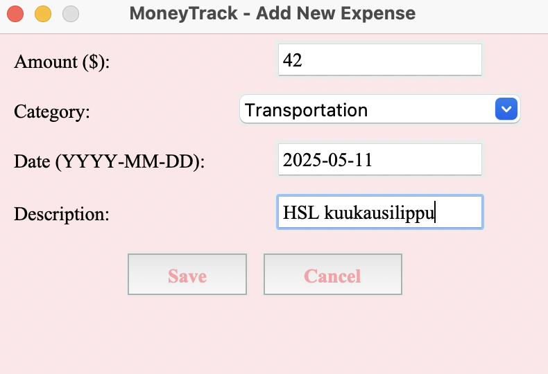

# Käyttöohje

## Konfigurointi
## Ohjelman käynnistäminen

1. Asenna riippuvuudet komennolla
```bash
poetry install
```
2. Alusta tietokanta ennen ohjelman käynnistämistä
```bash
poetry run invoke build
```
3. Nyt ohjelman voi käynnistää komennolla
```bash
poetry run invoke start
```

## Kirjautuminen

Sovellus käynnistyy kirjautumisnäkymään:


Syötä käyttäjätunnuksesi ja salasanasi kenttiin ja kirjaudu sisään painamalla "Login" -painiketta.

## Uuden käyttäjän luominen

Kirjautumissivulla voidaan siirtyä uuden käyttäjän luontinäyttöön napsauttamalla "Register"-painiketta. Luo uusi käyttäjä syöttämällä tiedot syöttökenttiin ja painamalla "Submit"-painiketta:

Jos käyttäjän luominen onnistuu, siirrytään kirjautumisnäkymään.

## Käyttäjän Omasivu
Kirjautumisen onnistumisen jälkeen, siirrytään käyttäjän omasivulla. Sivun yläreunassa käyttäjät voivat valita kuukauden ja vuoden ja napsauttaa sitten "Search"-painiketta nähdäkseen kyseisen ajanjakson kulut. Oikealla puolella voidaan napsauttaa "Export to CSV" viedäksesi CSV-tiedoston. Kirjaudu ulos napsauttamalla "Log out"-painiketta.


## Kulun luominen, muokkaminen ja poistaminen
Klikkaamalla "Add New expenses" -painiketta pääset kulujen lisäämissivulle. Täytä summa, päivämäärä, tyyppi ja kuvaus. Tallenna napsauttamalla "save"-painiketta, niin uudet kulut näkyvät etusivullasi.

Käyttäjä voi muuttaa tai poistaa kulun napsauttaamalla riviä, napsauttaa sitten "Edit selected" tai napsauttaa "delete selected". Sitten siiryytään luominen sivuun, tiedot on jo tallennettu sinne, ja voit muokata suoraan haluamaasi sisältöä.

