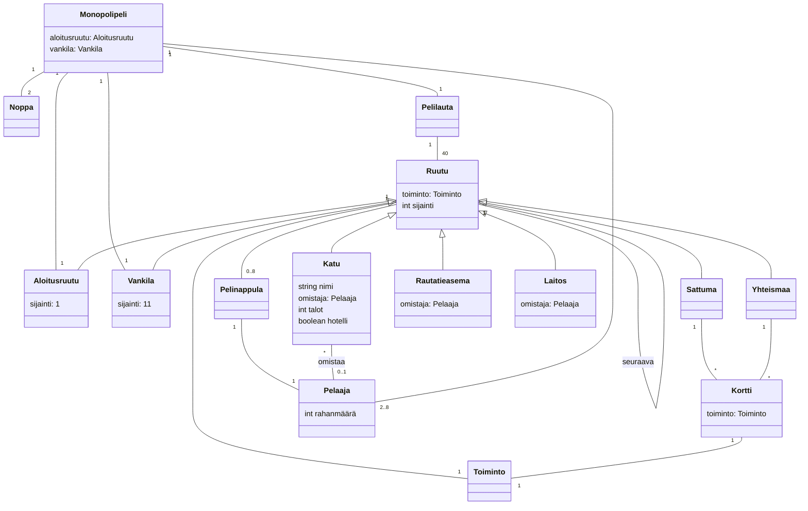

## Monopoli, luokkakaavio

```mermaid
 classDiagram
    class Monopolipeli{
        aloitusruutu: Aloitusruutu
        vankila: Vankila
    }
    class Noppa
    class Pelilauta
    class Toiminto
    class Kortti{
        toiminto: Toiminto
    }
    class Ruutu {
        toiminto: Toiminto
        int sijainti
    }
    class Aloitusruutu {
        sijainti: 1
    }
    class Vankila{
        sijainti: 11
    }
    class Sattuma
    class Yhteismaa
    class Katu{
        string nimi
        omistaja: Pelaaja
        int talot
        boolean hotelli
    }
    class Rautatieasema{
        omistaja: Pelaaja
    }
    class Laitos{
        omistaja: Pelaaja
    }
    class Pelaaja{
        int rahanmäärä
    }
    class Pelinappula

    Monopolipeli "1" -- "2" Noppa
    Monopolipeli "1" -- "1" Pelilauta
    Monopolipeli "1" -- "1" Aloitusruutu
    Monopolipeli "1" -- "1" Vankila
    Pelilauta "1" -- "40" Ruutu
    Ruutu "1" -- "1" Ruutu : seuraava
    Ruutu "1" -- "0..8" Pelinappula
    Pelinappula "1" -- "1" Pelaaja
    Pelaaja "2..8" -- "1" Monopolipeli

    Ruutu <|-- Aloitusruutu
    Ruutu <|-- Vankila
    Ruutu <|-- Sattuma
    Ruutu <|-- Yhteismaa
    Ruutu <|-- Rautatieasema
    Ruutu <|-- Laitos
    Ruutu <|-- Katu

    Ruutu "1" -- "1" Toiminto
    Sattuma "1" -- "*" Kortti
    Yhteismaa "1" -- "*" Kortti
    Kortti "1" -- "1" Toiminto
    Katu "*" -- "0..1" Pelaaja : omistaa
```